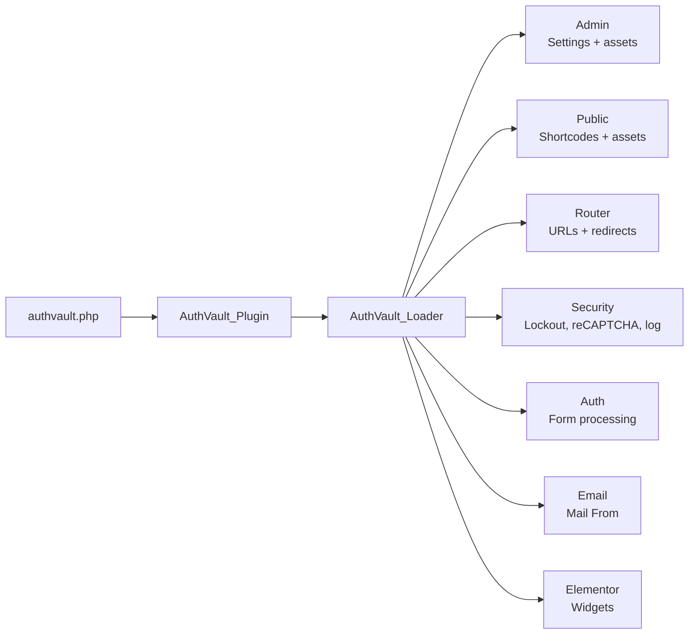
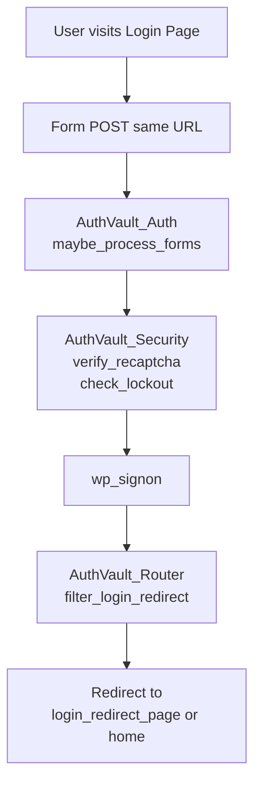

# WP AuthVault — Documentation

A complete guide to how the plugin works and how to use it.

---

## Table of contents

1. [Introduction and overview](#1-introduction-and-overview)
2. [Quick start (how to use it)](#2-quick-start-how-to-use-it)
3. [Architecture overview](#3-architecture-overview)
4. [File-by-file reference](#4-file-by-file-reference)
5. [User flows (step-by-step)](#5-user-flows-step-by-step)
6. [Settings reference](#6-settings-reference)
7. [Theme and template override](#7-theme-and-template-override)
8. [Build and release](#8-build-and-release)
9. [Summary diagram](#9-summary-diagram)

---

## 1. Introduction and overview

### What is WP AuthVault?

WP AuthVault replaces WordPress’s default login, registration, and password-reset flows with your own pages. You get:

- **Custom pages** for login, register, “forgot password,” and “set new password,” each styleable with your theme or with Elementor.
- **Shortcodes** to drop forms into any page: `[authvault_login]`, `[authvault_register]`, `[authvault_reset_password]`, `[authvault_reset_password_confirm]`.
- **Elementor widgets** (AuthVault category): Login, Register, Reset Password, and Reset Password Confirm, with content and style controls.
- **Security options**: brute-force lockout (IP-based), optional Google reCAPTCHA v3, optional login-attempt logging, password strength and length rules, rate limiting on password-reset requests.
- **URL hardening**: optional custom login slug (e.g. `/login` instead of `wp-login.php`) and hiding of `wp-login.php` (404, redirect to home, or redirect to a custom page).

All settings are in **Settings → AuthVault**, in a tabbed interface (General, Security, Access Control, Email, Messages, Logs).

### Requirements

- **PHP** 8.0 or higher  
- **WordPress** 6.4 or higher  
- **Composer** (for installation): run `composer install` in the plugin directory so the autoloader and dependencies are present.  
- **Elementor** (optional): required only if you use the AuthVault Elementor widgets. If Elementor is not active, the plugin still works with shortcodes.

### Installation

1. Upload the plugin to `wp-content/plugins/wp-authvault` (or install via ZIP).
2. In the plugin directory, run:  
   `composer install`  
   (If you skip this, the plugin will show an admin notice and will not load.)
3. In WordPress admin, go to **Plugins** and activate **WP AuthVault**.

**On activation**, the plugin:

- Checks PHP and WordPress version (and stops with an error if too low).
- Creates the **login log** table `wp_*_authvault_login_log` (used only if “Log login attempts” is enabled later).
- Saves the current **DB version** in the option `authvault_db_version`.
- Saves **default options** in `authvault_settings` only if no settings exist yet (it does not overwrite existing settings on re-activation).
- **Creates four default pages** if they do not already exist: **Login**, **Register**, **Password Reset**, and **Set New Password**, each with the corresponding shortcode in the content. Their IDs are stored in `authvault_settings`. These pages are marked with post meta `_authvault_created_by_plugin` so they can be removed on uninstall.
- **Schedules a daily cron event** (`authvault_cleanup_login_log`) to delete old login log entries based on the configured retention period.
- **Flushes rewrite rules** so the custom login slug (e.g. `/login`) works.

After activation, go to **Settings → AuthVault** to assign or change the pages and adjust security, email, and messages.

---

## 2. Quick start (how to use it)

### After activation

1. Open **Settings → AuthVault**.
2. On the **General** tab, the plugin may have already created and assigned Login, Register, Password Reset, and Set New Password pages. You can keep them or change any assignment to another page.
3. Assign **After Login Redirect** and **After Logout Redirect** if you want users sent to specific pages instead of the site home.

### Two ways to show forms

**Option A — Shortcodes**

Add one shortcode per form on the right page:

- **Login**: `[authvault_login]` → use on the page set as “Login Page.”
- **Register**: `[authvault_register]` → use on the “Register Page.”
- **Password reset (request link)**: `[authvault_reset_password]` → use on the “Password Reset Page.”
- **Set new password (after email link)**: `[authvault_reset_password_confirm]` → use on the “Set New Password Page.”

**Option B — Elementor**

1. Edit a page with Elementor.
2. In the widget panel, open the **AuthVault** category.
3. Drag **AuthVault Login**, **AuthVault Register**, **AuthVault Reset Password**, or **AuthVault Reset Password Confirm** onto the page.
4. Use the widget’s Content and Style tabs to customize labels, placeholders, buttons, and appearance.

The widgets output the same forms as the shortcodes; they just allow visual control without touching code.

### Settings in a nutshell

- **General**: Page assignments (login, register, reset, set-new-password, redirects) and registration (allow registration, default role).
- **Security**: Brute-force lockout (enable, max attempts, duration, optional admin email), password policy (min length, allow weak passwords), rate limiting for reset requests, reCAPTCHA v3 (enable, keys, minimum score).
- **Access Control**: Custom login URL slug, hide `wp-login.php` (and choose 404 / home / custom page), and where to send already-logged-in users who visit login/register (home, dashboard, or custom page).
- **Email**: Override the “From” name and address for WordPress emails; optional custom subject and body for the password-reset email.
- **Messages**: Customize every user-facing message (login error, lockout, registration success, reset success, etc.). Leave a field blank to use the plugin default.
- **Logs**: Enable/disable login logging, set retention period, view login attempts with filters (status, date range, user search), paginated table with user profile links, and CSV export. Old entries are automatically deleted by a daily cron job based on the retention period.

---

## 3. Architecture overview

### Bootstrap

**File: `authvault.php`**

- Defines constants: `AUTHVAULT_VERSION`, `AUTHVAULT_PLUGIN_DIR`, `AUTHVAULT_PLUGIN_URL`, `AUTHVAULT_PLUGIN_BASENAME`, `AUTHVAULT_MIN_PHP`, `AUTHVAULT_MIN_WP`, `AUTHVAULT_DB_VERSION`.
- Checks PHP and WordPress versions; if too low, shows an admin notice and exits (plugin does not load).
- Requires `vendor/autoload.php`; if missing, shows a “run composer install” notice and exits.
- Registers **activation** hook → `AuthVault_Activator::activate`.
- Registers **deactivation** hook → `AuthVault_Deactivator::deactivate`.
- Defines function `authvault()`: creates the single instance of `AuthVault_Plugin`, calls `run()`, and returns it. Then calls `authvault()` so the plugin runs.

### Plugin core

**File: `includes/class-authvault-plugin.php`**

The main plugin class:

- Builds the **Loader** (`AuthVault_Loader`) and uses it to register all hooks.
- **set_locale**: Registers `AuthVault_I18n::load_plugin_textdomain` on `plugins_loaded`.
- **define_admin_hooks**: Registers `AuthVault_Admin` for admin CSS/JS and instantiates `AuthVault_Settings` (settings page).
- **define_public_hooks**: Registers `AuthVault_Public` for front-end CSS/JS and shortcodes.
- **define_router_hooks**: Registers `AuthVault_Router` for init, rewrite rules, query vars, template_redirect (custom slug + protect auth pages), and filters: `login_url`, `logout_url`, `register_url`, `lostpassword_url`, `network_site_url`, `login_redirect`.
- **define_security**: Instantiates `AuthVault_Security::get_instance()` (singleton).
- **define_auth_hooks**: Registers `AuthVault_Auth` for `init` (form processing) and `template_redirect` (validate reset key on confirm page).
- **define_email_hooks**: Registers the plugin’s own `filter_mail_from_email` and `filter_mail_from_name` on `wp_mail_from` and `wp_mail_from_name`.
- **define_elementor_integration**: Instantiates `AuthVault_Elementor` (category + widgets + front-end styles; admin notice if Elementor not active).

The only logic inside the plugin class (besides hook registration) is the two mail-from filters, which read `override_lost_password_email`, `email_from_email`, and `email_from_name` from settings.

### Loader

**File: `includes/class-authvault-loader.php`**

- Holds two arrays: **actions** and **filters**.
- **add_action** / **add_filter**: Store hook name, component instance, callback name, priority, and number of arguments.
- **run()**: Loops over stored filters and actions and registers them with WordPress `add_filter` / `add_action`.

So every plugin hook is registered in one place: the Loader.

### High-level flow

---

## 4. File-by-file reference

Paths are relative to the plugin root. The following excludes `vendor/`, `node_modules/`, and `tests/`.

### authvault.php

- **Entry point**. Defines constants (version, paths, basename, min PHP/WP, DB version), runs version checks, requires Composer autoload, registers activation/deactivation hooks, defines `authvault()` and runs it.

### uninstall.php

- Runs when the plugin is **deleted** (not on deactivate).
- Deletes options: `authvault_settings`, `authvault_db_version`.
- Drops table `$wpdb->prefix . 'authvault_login_log'`.
- Deletes transients whose option name starts with `_transient_authvault_` or `_transient_timeout_authvault_`.
- Deletes only **pages** that have post meta `_authvault_created_by_plugin` = 1 (pages the plugin created on activation).

### includes/class-authvault-plugin.php

- Described in [Architecture overview](#3-architecture-overview). Defines: `load_dependencies`, `set_locale`, `define_admin_hooks`, `define_public_hooks`, `define_router_hooks`, `define_elementor_integration`, `define_security`, `define_auth_hooks`, `define_email_hooks`, `run`, and the two `filter_mail_from_*` methods.

### includes/class-authvault-loader.php

- Described in [Architecture overview](#3-architecture-overview). Methods: `add_action`, `add_filter`, `add` (internal), `run`.

### includes/class-authvault-activator.php

- **activate()** (static): `check_requirements()` (PHP/WP version, wp_die if not met), `create_login_log_table()`, `save_db_version()`, `ensure_default_options()`, `create_default_pages()`, `schedule_log_cleanup()`, then `flush_rewrite_rules(false)`.
- **create_login_log_table()**: Uses `dbDelta()` to create `wp_*_authvault_login_log` (id, user_login, ip_hash, status, attempted_at).
- **schedule_log_cleanup()** (static): Schedules the `authvault_cleanup_login_log` daily cron event if not already scheduled. Also called on every page load (in `AuthVault_Plugin::define_security()`) to self-heal if the event was missed.
- **ensure_default_options()**: If `authvault_settings` does not exist, saves `AuthVault_Options::get_defaults()`. Does not overwrite on re-activation.
- **create_default_pages()**: For login, register, password_reset, password_reset_confirm, creates a page with the right shortcode if no such page exists (by title), then updates `authvault_settings` with the page IDs. Uses **CREATED_BY_PLUGIN_META_KEY** = `_authvault_created_by_plugin` so uninstall can delete only these pages.
- **create_page_if_not_exists($title, $content)**: Uses `WP_Query` to see if a published page with that title exists; if not, `wp_insert_post` and sets the meta above.

### includes/class-authvault-deactivator.php

- **deactivate()** (static): Unschedules `authvault_cleanup_login_log` cron and calls `flush_rewrite_rules(false)`. No data or options are removed.

### includes/class-authvault-options.php

- **OPTION_NAME** = `'authvault_settings'`.
- **get($key = null, $default = null)**: Reads the option, merges with `get_defaults()`, returns one key or the full array.
- **set($key, $value = null)**: Merges into current options and updates the single option row.
- **get_defaults()**: Returns the full list of default keys and values (see [Settings reference](#6-settings-reference)).

### includes/authvault-helpers.php

- **authvault_get_option($key, $default)**: Wrapper around `AuthVault_Options::get()`.
- **authvault_get_message($key, $default)**: Returns the message option or the default if the stored value is empty.
- **authvault_is_elementor_editor_or_preview()**: Returns true when in Elementor edit or preview mode (used so reset-confirm form can show a preview without real key/login).
- **authvault_get_settings_defaults()**: Returns `AuthVault_Options::get_defaults()`.
- **authvault_asset_url($relative_path)**: Returns the plugin URL for an asset; if not `SCRIPT_DEBUG` and a `.min.css` / `.min.js` file exists, returns the minified URL.
- **authvault_attributes_string($attrs, $exclude)**: Builds a string of HTML attributes from an array (used in templates for wrapper attributes).

### includes/class-authvault-i18n.php

- **load_plugin_textdomain()**: Calls `load_plugin_textdomain('authvault', false, dirname(AUTHVAULT_PLUGIN_BASENAME) . '/languages/')`. Hooked on `plugins_loaded`.

### includes/class-authvault-router.php

- **LOGIN_QUERY_VAR** = `'authvault_login'`.
- **intercept_blocked_urls()** (init, priority 1): When “Enable login URL hiding” is on, detects requests to `wp-login.php` or `wp-admin` (for non-logged-in users). Allows cron, AJAX, and requests that match the custom login slug. Otherwise applies **wp_login_access_behavior**: 404, redirect to home, or redirect to **wp_login_redirect_page_id**.
- **add_rewrite_rules()**: Adds a rule so that the **custom_login_slug** (e.g. `login`) maps to `index.php?authvault_login=1`.
- **add_query_vars($vars)**: Pushes `authvault_login` onto the query vars array.
- **redirect_custom_login_slug()** (template_redirect, priority 1): If the query var is set, redirects to the URL of **login_page_id**.
- **protect_auth_pages()** (template_redirect, priority 5): If the user is logged in and the current page is the login or register page (and not Elementor preview), redirects according to **logged_in_redirect_behavior**: home, dashboard (admin_url()), or **logged_in_redirect_page_id**.
- **filter_login_url**, **filter_logout_url**, **filter_register_url**, **filter_lostpassword_url**: Point these WordPress auth URLs to the assigned AuthVault pages (and add redirect_to where applicable).
- **filter_network_site_url**: Rewrites `wp-login.php` URLs (e.g. in emails) to the AuthVault login or reset-confirm page with key/login when appropriate.
- **filter_login_redirect**: After login, sends the user to the requested redirect URL if valid, else to **login_redirect_page_id** or home.
- **get_logout_redirect_url()** (private): Returns **logout_redirect_page_id** permalink or home; used by the Auth class after logout.

### includes/class-authvault-security.php

- **Singleton**: `get_instance()`.
- **Transients**: `ATTEMPTS_TRANSIENT_PREFIX` (attempt count per IP hash), `LOCKOUT_TRANSIENT_PREFIX` (lockout expiry). Only hashed IPs are used; no raw IP is stored.
- **check_lockout($identifier)**: Returns true if the IP hash is currently locked out (when **enable_lockout** is on).
- **get_lockout_remaining_minutes($identifier)**: Returns remaining lockout time in minutes.
- **record_attempt($identifier)**: Increments attempt count; if it reaches **max_login_attempts**, sets lockout for **lockout_duration_minutes**.
- **clear_attempts($identifier)**: Deletes the attempt transient (called on successful login).
- **verify_recaptcha($token)**: If reCAPTCHA is disabled, returns true. Otherwise calls Google’s siteverify API and compares **score** to **recaptcha_min_score** (option).
- **maybe_enqueue_recaptcha_script()** (static): Enqueues the reCAPTCHA v3 script once per request when **recaptcha_enabled** and **recaptcha_site_key** are set.
- **filter_site_url_wp_login** (site_url filter): Rewrites `wp-login.php` URLs to the AuthVault login page when URL hiding is on; always rewrites password-reset confirm links (action=rp) to the Set New Password page with key and login.
- **log_login_attempt($user_login, $ip_hash, $status)**: Inserts into `wp_*_authvault_login_log` when **enable_login_log** is on. **LOG_TABLE_NAME** = `'authvault_login_log'`.
- **cleanup_old_login_log_entries()** (static): Deletes rows from the login log table where `attempted_at` is older than **login_log_retention_days**. Called by the daily cron (`authvault_cleanup_login_log`) and immediately when retention is changed in settings.

### includes/class-authvault-auth.php

- **Nonce actions**: LOGIN_NONCE_ACTION, REGISTER_NONCE_ACTION, RESET_NONCE_ACTION, RESET_CONFIRM_NONCE_ACTION. Each form posts its own nonce.
- **maybe_process_forms()** (init, priority 1): If GET `action=logout` and valid log-out nonce → **process_logout()**. Else if POST, detects which form by nonce and calls **process_login**, **process_register**, **process_reset_request**, or **process_reset_confirm()**.
- **process_login()**: Verifies nonce, reCAPTCHA, lockout; sanitizes username/password; `wp_signon`; on success clears attempts and logs success, then redirects (POST redirect_to, or **login_redirect_page_id**, or home); on failure records attempt, logs failure, redirects to login page with `authvault_error=1` and optionally `authvault_lockout_minutes`.
- **process_register()**: Verifies nonce and **users_can_register**; `register_new_user`; sets **default_role**; redirects to login page with `registered=1`.
- **process_reset_request()**: Verifies nonce; checks **reset_rate_limit_*** (transient per IP); calls `retrieve_password($login)`; redirects to reset page with `authvault_reset_sent=1`.
- **process_reset_confirm()**: Verifies nonce; reads key/login from GET or POST; `check_password_reset_key`; validates password length (**min_password_length**) and strength (**allow_weak_passwords**); on success `reset_password()` and redirect to login with `password_reset=1`; on validation error stores messages in **$confirm_errors** and re-renders form.
- **process_logout()**: Verifies log-out nonce; `wp_logout()`; redirects via **logout_redirect_page_id** or home.
- **validate_reset_key_on_confirm_page()** (template_redirect, priority 2): On the Set New Password page, if key/login are in GET, runs `check_password_reset_key`; if invalid, redirects to reset request page with `error=invalidkey`.

### includes/class-authvault-template-loader.php

- **THEME_OVERRIDE_DIR** = `'authvault'`.
- **locate_template($template_name)**: Resolves name to `.php`, then looks in: child theme `authvault/`, theme `authvault/`, plugin `templates/`. Returns the first readable path.
- **load_template($template_name, $args)**: Locates the file, merges $args with default `messages` and `wrapper_attributes`, extracts, and includes the file.

### includes/authvault-template-functions.php

- **authvault_locate_template**, **authvault_load_template**: Thin wrappers around the template loader.
- **authvault_get_login_form($args, $echo)**: Merges args with defaults (form title, labels, placeholders, submit text, remember me, forgot password link, register link, etc.). Injects messages from GET (`authvault_error`, `authvault_lockout_minutes`, `registered`, `password_reset`). Calls **AuthVault_Security::maybe_enqueue_recaptcha_script()**, then loads `login` template. Returns or echoes HTML.
- **authvault_get_register_form**, **authvault_get_reset_form**, **authvault_get_reset_confirm_form**: Same idea for register, reset request, and reset confirm (confirm form receives `rp_key`, `rp_login`, and `messages` from **AuthVault_Auth::get_confirm_errors()**).

### admin/class-authvault-admin.php

- Enqueues **authvault-admin.css** and **authvault-admin.js** only on the AuthVault settings page. Uses **AuthVault_Settings::get_page_hook()** to detect the page (`settings_page_authvault-settings`).

### admin/class-authvault-settings.php

- Adds **Settings → AuthVault** via `add_options_page` (slug `authvault-settings`, capability `manage_options`).
- Registers one setting: **OPTION_GROUP** `authvault_settings_group`, **OPTION_NAME** `authvault_settings`, type array, **sanitize_callback** `sanitize_settings`.
- **render_page()**: Outputs tab nav (General, Security, Access Control, Email, Messages), then one form that wraps all tab panels. Each panel is rendered by `render_tab_general()`, `render_tab_security()`, etc. Save button submits to `options.php`. Separate “Reset to defaults” form with its own nonce and confirmation message.
- **sanitize_settings($input)**: Merges input with defaults, then sanitizes and validates every key (page IDs, slugs, booleans, numbers, roles, email, message strings, etc.). Syncs **enable_user_registration** to `users_can_register`. Used by the Settings API on save.
- **handle_reset()** (admin_init, priority 5): If POST contains the reset nonce, replaces `authvault_settings` with defaults and redirects with success/error param.
- **handle_export_login_log()**: AJAX handler (`wp_ajax_authvault_export_login_log`). Verifies nonce and `manage_options`, applies same filters (status, user, date range), streams CSV (up to 10,000 rows).
- **render_tab_logs()**: Login log settings (enable, retention) and, when logging is enabled, the log viewer. The viewer includes filters (status, date range, user search), export CSV button, paginated table with user profile links for successful logins.
- Row helpers: **render_page_row**, **render_checkbox_row**, **render_number_row**, **render_text_row**, **render_email_row**, **render_password_row**, **render_score_row**, **render_select_row**, **render_role_row**, **render_textarea_row**, **render_message_row**, **render_section_heading**.

### public/class-authvault-public.php

- **register_shortcodes()**: Registers `authvault_login`, `authvault_register`, `authvault_reset_password`, `authvault_reset_password_confirm`. Each shortcode calls the corresponding `authvault_get_*_form()` with default args (and for reset_confirm, handles missing key/login and Elementor preview).
- **enqueue_styles** / **enqueue_scripts**: Enqueue **authvault-public.css** and **authvault-public.js** on the front end. Localize **authvaultStrength** (password strength labels) for the public script.

### elementor/class-authvault-elementor.php

- **CATEGORY_SLUG** = `'authvault'`.
- Constructor: If `elementor/loaded` already fired, calls **init()**; else hooks **init** on `elementor/loaded` and **maybe_show_elementor_notice** on `admin_notices` (notice only on plugins/dashboard for users who can activate plugins).
- **init()**: Registers category (title “AuthVault”, icon `eicon-lock-user`), registers four widgets (Login, Register, Reset Password, Reset Password Confirm), and enqueues **authvault-elementor.css** on `elementor/frontend/after_enqueue_styles`.

### elementor/widgets/

- **class-authvault-widget-login.php**, **class-authvault-widget-register.php**, **class-authvault-widget-reset-password.php**, **class-authvault-widget-reset-password-confirm.php**: Each extends `Elementor\Widget_Base`, belongs to category `authvault`, and in **register_controls()** adds Content and Style sections. Content controls mirror the template args (form title, labels, placeholders, submit text, show/hide links, etc.). **render()** builds an args array from the controls and calls `authvault_get_login_form($args, false)` (or the corresponding form function). So the widgets are a visual way to set the same arguments that the shortcodes/template functions accept.

### templates/

- **login.php**: Variables (e.g. show_form_title, form_title_text, show_labels, show_placeholders, submit_button_text, redirect_after_success, show_remember_me, show_forgot_password_link, forgot_password_link_text, show_register_link, register_link_text, show_form_description, form_description, show_email_icon, show_password_icon, show_password_toggle, username_label, username_placeholder, password_label, password_placeholder, messages, wrapper_attributes). Outputs wrapper div, messages block, optional title/description, form with nonce, username and password inputs, remember me, submit, forgot password and register links. Uses `wp_login_url()`, `wp_lostpassword_url()`, `wp_registration_url()` (all filtered by the router).
- **register.php**: Similar structure for username, email, submit, and login link.
- **reset-password.php**: Single user_login (email/username) field and submit; back-to-login link.
- **reset-password-confirm.php**: Password and confirm fields, optional strength meter, nonce, rp_key and rp_login hidden inputs, submit. Uses **min_password_length** and **allow_weak_passwords** for validation (in Auth class); messages from $messages (confirm errors).

### assets/

- **authvault-admin.css**: Styles for the settings page (tabs, form tables, toggles, status dots, section headings, responsive).
- **authvault-admin.js**: Tab switching (URL hash), conditional visibility for dependent fields (lockout, reCAPTCHA, email override, redirect pages), updating status dots when page dropdowns change, and auto-switching to the Logs tab when log filter query params are present in the URL.
- **authvault-public.css**: Styles for the front-end forms (login, register, reset, reset-confirm).
- **authvault-public.js**: Front-end behavior (e.g. password visibility toggle, strength meter labels from `authvaultStrength`).
- **authvault-elementor.css**: Elementor-specific form styling so widgets look correct in the editor and on the front end.
- Minified versions (`.min.css`, `.min.js`) are produced by `npm run minify` (terser for JS, cleancss for CSS). The plugin enqueues minified assets when they exist and `SCRIPT_DEBUG` is not set (via **authvault_asset_url**).

### languages/authvault.pot

- Translation template. All user-facing strings in the plugin use the text domain **authvault** and are loaded from the `languages/` directory.

### composer.json

- **require**: php >=8.0. **require-dev**: phpunit, brain/monkey.
- **autoload**: PSR-4 namespaces **AuthVault\\** → includes/, **AuthVault\\Admin\\** → admin/, **AuthVault\\Public_Area\\** → public/, **AuthVault\\Elementor\\** → elementor/, **AuthVault\\Elementor\\Widgets\\** → elementor/widgets/; classmap for those dirs; **files**: includes/authvault-helpers.php, includes/authvault-template-functions.php.
- **autoload-dev**: PSR-4 **AuthVault\\Tests\\** → tests/.

### package.json, build.js, update-plugin-version.js

- **package.json**: Scripts **minify** (JS + CSS), **minify:js** (terser for public and admin JS), **minify:css** (cleancss for public, admin, elementor CSS), **build** / **build:production** (minify then node build.js), **build:dev** (minify then composer dump-autoload), **zip** (node build.js), **version** (node update-plugin-version.js).
- **build.js**: Builds a distributable zip. Ignores node_modules, .git, tests, and listed files (e.g. source CSS/JS that have .min counterparts). Runs `composer dump-autoload --no-dev` for the zip, then restores dev autoload. Adds vendor/autoload and vendor/composer to the archive.
- **update-plugin-version.js**: Keeps package.json and plugin header version in sync.

---

## 5. User flows (step-by-step)

### Login

1. User opens the **Login** page (shortcode `[authvault_login]` or AuthVault Login widget). The page URL is the one assigned in Settings → AuthVault → General (Login Page).
2. The form posts to the **same URL** with fields: username, password, optional remember, redirect_to, and **authvault_login_nonce**.
3. **AuthVault_Auth::maybe_process_forms()** runs on `init`. It sees **authvault_login_nonce** and calls **process_login()**.
4. **process_login()**: Verifies nonce; **AuthVault_Security::verify_recaptcha()** (if reCAPTCHA enabled); **check_lockout()** for the hashed IP — if locked out, redirect to login page with `authvault_error=1` and `authvault_lockout_minutes=N`. Otherwise sanitizes username/password and calls **wp_signon()**.
5. On **failure**: **record_attempt()**, **log_login_attempt(..., 'fail')**, redirect to login with `authvault_error=1`.
6. On **success**: **clear_attempts()**, **log_login_attempt(..., 'success')**, then redirect: if POST `redirect_to` is a valid URL use it, else use **login_redirect_page_id** permalink, else **home_url()**. The **login_url** filter (Router) ensures links like “Log in” point to the assigned login page.

### Register

1. User opens the **Register** page and submits username and email with **authvault_register_nonce**.
2. **process_register()**: Verifies nonce and **users_can_register** (synced from Settings “Allow registration”). **register_new_user($username, $email)**; then sets the user’s role to **default_role**.
3. Redirects to the **login** page with `registered=1`. The login template shows a success message when that query arg is present (using **msg_login_registered** or default).

### Password reset request

1. User opens the **Password Reset** page and submits **user_login** (email or username) with **authvault_reset_nonce**.
2. **process_reset_request()**: Verifies nonce; **check_reset_rate_limit()** (transient per IP, **reset_rate_limit_max** per **reset_rate_limit_window_minutes**); **retrieve_password($login)** (WordPress sends the email).
3. Redirects to the same reset page with `authvault_reset_sent=1` (generic message to avoid user enumeration). The reset link in the email is rewritten by **AuthVault_Security::filter_site_url_wp_login** and **AuthVault_Router::filter_network_site_url** to the **Set New Password** page with `?key=...&login=...`.

### Set new password

1. User clicks the link in the email and lands on the **Set New Password** page with `key` and `login` in the URL.
2. **validate_reset_key_on_confirm_page()** (template_redirect): On that page, **check_password_reset_key($key, $login)** runs; if invalid/expired, redirects to the Password Reset page with `error=invalidkey`.
3. User submits new password and confirm with **authvault_reset_confirm_nonce**, and hidden **rp_key** and **rp_login**.
4. **process_reset_confirm()**: Verifies nonce; validates key/login again; checks password length (**min_password_length**) and strength (**allow_weak_passwords**). If validation fails, stores errors in **AuthVault_Auth::$confirm_errors** and the form re-renders with messages. If OK, **reset_password($user, $pass1)** and redirects to the **login** page with `password_reset=1`.

### Logout

1. User clicks a “Log out” link. The **logout_url** filter (Router) returns the **login** page URL with `?action=logout&_wpnonce=...` (WordPress log-out nonce).
2. **maybe_process_forms()** sees GET `action=logout` and calls **process_logout()**.
3. **process_logout()**: Verifies nonce, **wp_logout()**, then redirects to **logout_redirect_page_id** or **home_url()**.

---

## 6. Settings reference

All options live in the single option **authvault_settings**. Below: key, type, default, and where it’s used.

### General tab

| Option key | Type | Default | Used in |
|------------|------|---------|--------|
| login_page_id | int (page ID) | 0 | Router (login_url, logout_url, redirect_custom_login_slug, protect_auth_pages, network_site_url), Auth (redirects), Security (filter_site_url_wp_login), Public shortcode (reset confirm link), template-functions (login form URLs) |
| register_page_id | int | 0 | Router (register_url, protect_auth_pages), Auth (redirect_register_with_error) |
| password_reset_page_id | int | 0 | Router (lostpassword_url), Auth (redirect_reset_request, redirect_reset_confirm_error), Public shortcode (reset confirm “request reset” link) |
| password_reset_confirm_page_id | int | 0 | Router (network_site_url for reset link), Security (filter_site_url_wp_login for action=rp), Auth (validate_reset_key_on_confirm_page) |
| login_redirect_page_id | int | 0 | Router (filter_login_redirect, protect_auth_pages when logged-in redirect was “login redirect page” in older logic; now logged_in_redirect_behavior), Auth (redirect after login) |
| logout_redirect_page_id | int | 0 | Router (get_logout_redirect_url), Auth (redirect_after_logout) |
| enable_user_registration | bool | false | Options/sanitize (syncs users_can_register), Auth (process_register checks get_option('users_can_register')) |
| default_role | string | 'subscriber' | Options/sanitize (editable roles), Auth (process_register sets user role) |

### Security tab

| Option key | Type | Default | Used in |
|------------|------|---------|--------|
| enable_lockout | bool | true | Security (check_lockout, record_attempt) |
| max_login_attempts | int | 5 | Security (record_attempt) |
| lockout_duration_minutes | int | 15 | Security (record_attempt, get_lockout_remaining_minutes) |
| lockout_admin_email_notification | bool | false | Settings only (future: send email on lockout) |
| lockout_notification_email | string (email) | '' | Settings only |
| min_password_length | int | 8 | Auth (process_reset_confirm), template-functions (reset confirm form) |
| allow_weak_passwords | bool | false | Auth (process_reset_confirm), template-functions |
| reset_rate_limit_max | int | 5 | Auth (check_reset_rate_limit) |
| reset_rate_limit_window_minutes | int | 15 | Auth (check_reset_rate_limit) |
| recaptcha_enabled | bool | false | Security (verify_recaptcha, maybe_enqueue_recaptcha_script), template-functions (enqueue in login/register) |
| recaptcha_site_key | string | '' | Security (maybe_enqueue_recaptcha_script) |
| recaptcha_secret_key | string | '' | Security (verify_recaptcha) |
| recaptcha_min_score | float | 0.5 | Security (verify_recaptcha) |

### Access Control tab

| Option key | Type | Default | Used in |
|------------|------|---------|--------|
| custom_login_slug | string (slug) | 'login' | Router (add_rewrite_rules, redirect_custom_login_slug, is_allowed_request) |
| enable_login_url_hiding | bool | false | Router (intercept_blocked_urls), Security (filter_site_url_wp_login) |
| wp_login_access_behavior | '404' \| 'home' \| 'page' | '404' | Router (apply_blocked_url_behavior) |
| wp_login_redirect_page_id | int | 0 | Router (apply_blocked_url_behavior when behavior is 'page') |
| logged_in_redirect_behavior | 'home' \| 'dashboard' \| 'page' | 'dashboard' | Router (protect_auth_pages) |
| logged_in_redirect_page_id | int | 0 | Router (protect_auth_pages when behavior is 'page') |

### Email tab

| Option key | Type | Default | Used in |
|------------|------|---------|--------|
| override_lost_password_email | bool | false | Plugin (filter_mail_from_email, filter_mail_from_name) |
| email_from_name | string | '' | Plugin (filter_mail_from_name) |
| email_from_email | string | '' | Plugin (filter_mail_from_email) |
| reset_email_subject | string | '' | Settings only (future: custom reset email subject) |
| reset_email_body | string | '' | Settings only (future: custom reset email body) |

### Messages tab

| Option key | Type | Default | Used in |
|------------|------|---------|--------|
| msg_login_error | string | '' | authvault_get_message in template-functions (login form error) |
| msg_login_lockout | string | '' | template-functions (login form lockout message, %d = minutes) |
| msg_login_registered | string | '' | template-functions (login form after registered=1) |
| msg_login_password_reset | string | '' | template-functions (login form after password_reset=1) |
| msg_register_error | string | '' | template-functions (register form error) |
| msg_reset_sent | string | '' | template-functions (reset request form success) |
| msg_reset_invalid_key | string | '' | template-functions (reset request form invalid key) |
| msg_confirm_invalid_link | string | '' | template-functions, Public shortcode (reset confirm invalid link) |
| msg_confirm_password_empty | string | '' | Auth (process_reset_confirm), template-functions |
| msg_confirm_password_mismatch | string | '' | Auth, template-functions |
| msg_confirm_password_weak | string | '' | Auth (%d = min length), template-functions |
| msg_confirm_password_too_weak | string | '' | Auth, template-functions |

### Logs tab

| Option key | Type | Default | Used in |
|------------|------|---------|--------|
| enable_login_log | bool | false | Security (log_login_attempt), Settings (Logs tab viewer visibility) |
| login_log_retention_days | int | 90 | Security (cleanup_old_login_log_entries), Settings (sanitize triggers cleanup on change) |

The Logs tab also contains the **login log viewer** (not a stored option): a filterable, paginated table of login attempts with columns Date/Time, User Login (linked to profile for successful logins), Status, and IP Hash (last 8 chars). Filters: status (all/success/fail), user search, date range. Includes an **Export CSV** button. Old entries are automatically deleted by the `authvault_cleanup_login_log` daily cron event based on the retention period.

---

## 7. Theme and template override

To override a form template with your theme:

1. In your theme (or child theme) root, create a folder named **authvault**.
2. Copy the template you want to change from the plugin’s **templates/** folder into **authvault/** and keep the same filename.

Template names (without `.php`):

- **login**
- **register**
- **reset-password**
- **reset-password-confirm**

The loader looks in this order: **child theme** `authvault/<name>.php` → **theme** `authvault/<name>.php` → **plugin** `templates/<name>.php`. The first readable file is used. Keep the same template variables (see the `@var` block at the top of each plugin template) so that shortcodes and widgets still pass the correct data.

---

## 8. Build and release

- **Development**: Run `composer install` and `npm install` in the plugin directory.
- **Minify assets**: `npm run minify` — produces `.min.js` and `.min.css` for admin, public, and elementor assets.
- **Full build / zip**: `npm run build` (or `npm run build:production`) — runs minify then `node build.js`, which creates the distributable zip (e.g. `wp-authvault.zip`). The zip excludes dev dependencies and, when minified assets exist, excludes the non-minified source CSS/JS. Composer autoload is dumped with `--no-dev` for the zip, then restored for development.
- **Version sync**: `npm run version` runs `update-plugin-version.js` to align version in package.json and the main plugin file header.

---

## 9. Summary diagram

---

*End of documentation.*
